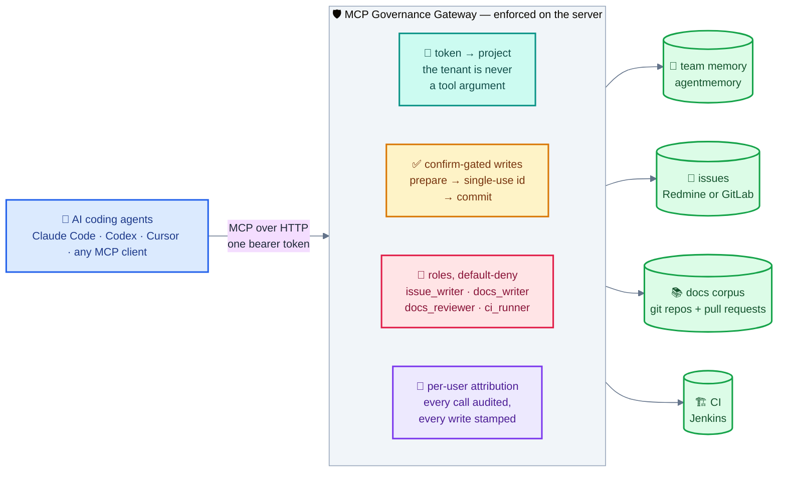

# MCP Governance Gateway

**One MCP endpoint that lets a team hand its memory, issue tracker, docs corpus and CI to
autonomous coding agents — with the tenant, the confirmation and the audit enforced
server-side, not trusted from the client.**

[](https://github.com/aarontzeng/mcp-governance-gateway/actions/workflows/ci.yml)
[](https://github.com/aarontzeng/mcp-governance-gateway/releases)
[](LICENSE)




A governance and multi-tenancy layer between AI coding agents and the backends a team
already runs. Agents get a small, uniform set of MCP tools; the gateway decides, on the
server, which project a token may touch, which writes need a second call to confirm, which
roles a token holds, and who is on record for every action.

## What it stops

- **An agent reading another team's memory or issues.** The project comes from the token,
  server-side; there is no argument an agent could set to reach a different tenant.
- **An issue, a proposal or a build created because the model was confident.** Writes to a
  system of record return a single-use confirmation id bound to the exact arguments; nothing
  is written until a second call carries it back.
- **A shared service credential erasing who acted.** Every call, read or write, is audited
  under the acting identity; issue notes are stamped with it, and docs proposals are opened
  under the person's own enrolled credential. (CI triggers go out under the deployment's
  Jenkins account — the audit line is where the person is.)

## What an agent sees

The two-step write, as the gateway actually answers it (from the test suite):

```jsonc
// 1. the agent asks to create an issue
tools/call  issues.create  {"subject": "Boot loop on rev C boards"}

// → nothing is written; the gateway returns a confirmation bound to these arguments
{
  "confirmationRequired": true,
  "confirmationId": "…single-use, short-lived…",
  "action": "issues.create",
  "arguments": {"subject": "Boot loop on rev C boards"},
  "summary": "Create issue: 'Boot loop on rev C boards'",
  "instructions": "Re-call this tool with the arguments you sent — UNABRIDGED … plus \"confirm\": \"<confirmationId>\" to proceed."
}

// 2. the agent re-sends the same arguments plus the id
tools/call  issues.create  {"subject": "Boot loop on rev C boards", "confirm": "…"}

// → now it is written, under the caller's identity, and audited as such
{"created": true, "id": "4711", …}
```

A wrong or reused id, or changed arguments, gets a fresh confirmation instead of a write
(ADR-0003). Memory writes are not confirmed — they stay inside the caller's own project and
are secret-scanned and rate-limited instead.

The gateway is a single Python process (standard-library HTTP server, one third-party
dependency for encryption). Backends are pluggable and enabled by configuration — run only
the ones you need.

## Backends

| Capability | Tools | Backend |
|---|---|---|
| Team memory | `memory.search` / `save` / `list`, `memory.lesson_*`, `memory.action_*` | [agentmemory](https://github.com/rohitg00/agentmemory) (Apache-2.0) |
| Issue tracker | `issues.get` / `search` / `mine` / `categories` / `create` / `add_note` / `update_status` | Redmine **or** GitLab (per deployment) |
| Docs corpus | `docs.search` / `get` / `list` / `lint`, and — where a review host is configured — `docs.create` / `update` (inline or staged via `docs.asset_stage_url`) / `review_get` / `review_list` / `review_comment` / `review_add_reviewer` / `review_abandon` (own proposal only) | per-project Git repositories, indexed with a built-in BM25 (CJK-aware); proposals open pull requests on GitHub |
| CI | `ci.status` / `ci.builds` / `ci.log` / `ci.artifact`, plus `ci.rerun` / `ci.stop` | Jenkins (reads, and a gated trigger/stop) |

Each backend enforces the same tenancy discipline: operations are scoped to the
token's project, results are re-filtered wherever the backend returns the tenant
field, and errors never leak the existence of another tenant's data.

## Security model in one paragraph

A bearer token is an opaque handle resolved server-side to a set of claims
(`project`, `issue_project`, `actor`, `roles`). Optionally the gateway also
verifies **OIDC** access tokens from an IdP you configure (ADR-0016): the
signed `sub` becomes the actor, so nothing has to be minted by hand, while
tenancy still comes from a grants file this deployment owns — an IdP knows who
someone is, not which project of this gateway they may act in. The token string is still a
secret — whoever holds it acts as that principal — but it encodes nothing, so
the claims live on the server and renaming or re-scoping them needs no token
re-mint. (An OIDC access token does carry claims; the gateway reads identity
from them and takes tenancy from its own grants file regardless.) Writes additionally require a writer role
(default-deny). Optional per-user credentials (a personal Redmine key or GitLab
PAT) are held in an encrypted-at-rest keystore (AES-256-GCM) with the ciphertext
bound to the owner and backend, so a credential cannot be replayed as another
user's or another backend's. See [`docs/security-model.md`](docs/security-model.md)
and the [architecture decision records](docs/decisions/).

## Quickstart

Requires Python 3.11 or newer.

```bash
pip install .

# Minimal: memory backend only
export GATEWAY_TOKEN_FILE=/etc/mcp-governance-gateway/tokens.json   # project -> claims
export MEMORY_BASE_URL=http://127.0.0.1:3111
mcp-governance-gateway                              # serves MCP on :8080/mcp
```

Already run an identity provider? Point the gateway at it and skip the token
file entirely — the IdP becomes the minter ADR-0007 asks for, and onboarding a
person is one line in the grants file:

```bash
export OIDC_ISSUER=https://sso.example.internal/realms/main
export OIDC_AUDIENCE=mcp-governance-gateway
export OIDC_GRANTS_FILE=/etc/mcp-governance-gateway/oidc-grants.json
```

No identity provider? `mcpgw-admin` is the reference minter — it writes the
same token store, atomically, with tokens from `secrets` rather than from
whatever you would have typed:

```bash
mcpgw-admin --store /var/lib/mcp-governance-gateway/user-tokens.json \
  mint --actor 10000001 --project demo-project --role issue_writer
```

`--actor` has no default on purpose: ADR-0007 wants a verified immutable id,
and one this tool guessed from `$USER` would be neither.

Enable more backends by setting their environment variables (see
[`.env.example`](.env.example)):

- **Issues** — `ISSUE_BACKEND=redmine|gitlab` plus that backend's URL and token.
- **Docs corpus** — `DOCS_REPOS_FILE` (project → Git repo) and `DOCS_CLONE_DIR`.
- **CI** — `JENKINS_BASE_URL` and `CI_JOBS_FILE` (project → allowlisted jobs).

A token file entry looks like:

```json
{
  "tokens": [
    {
      "token": "<opaque-bearer>",
      "project": "demo-project",
      "issue_project": "demo",
      "actor": "10000001",
      "roles": ["issue_writer"]
    }
  ]
}
```

Run it in a container with the provided [`Dockerfile`](Dockerfile) (the image
includes `git` + `ssh` so the docs corpus can clone remote repositories).

## Configuration reference

All configuration is environment-driven; [`.env.example`](.env.example) lists
every variable with a comment. Nothing is enabled implicitly — a backend is
inert unless its variables are set.

## Documentation

| Document | What it covers |
|---|---|
| [Architecture](docs/architecture.md) | The planes, modules, request flow, and where identity comes from |
| [Security model](docs/security-model.md) | The trust boundaries and what each one assumes |
| [Operations](docs/operations.md) | Deployment shapes, token lifecycle, quotas, backend-isolation checklists |
| [ADRs](docs/decisions/) | Each decision, the alternatives weighed, and what enforces it |
| [Roadmap](docs/roadmap.md) | What is deliberately not here yet, and why |
| Adapters | [memory](docs/adapters/memory.md) · [issue tracker](docs/adapters/issue-tracker.md) · [docs corpus](docs/adapters/docs.md) · [CI](docs/adapters/ci.md) |

Start with [ADR-0001](docs/decisions/ADR-0001-mcp-governance-gateway.md) for what
the gateway is, then [ADR-0002](docs/decisions/ADR-0002-token-boundaries.md) and
[ADR-0003](docs/decisions/ADR-0003-confirmation-and-dangerous-actions.md) for the
two properties everything else preserves.

## Contributing

See [CONTRIBUTING.md](CONTRIBUTING.md) for the ground rules and
[SECURITY.md](SECURITY.md) for how to report a vulnerability privately.
Releases are recorded in [CHANGELOG.md](CHANGELOG.md).

## License

Apache License 2.0 — see [LICENSE](LICENSE).
